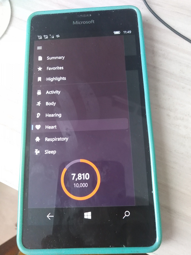

# HealthAppUNO

"Design/Code pattern": Multiplatform Health app Sample in Uno Platform

## Screenshots

## Description
This sample shows a concept of a Health app running on Windows 10, iOS, iPadOS, macOS, Android & WebAssembly 
using [Uno Platform](https://platform.uno/) (see also on [GitHub](https://github.com/unoplatform/uno/)). 

Inspired by [Jordan Singer](https://twitter.com/jsngr?s=20).

I used [Martin Zikmund 's Uno Health app "design pattern / code template"](https://github.com/MartinZikmund/uno-health-app-concept/) for my RnD.

## Status
- UWP Project fixed. I successfully changed min. os. build to  15063. Very strange bug "Memory access violation" solved by XAML editing ("padding" and "spacing" attrib. cut-off and somthing else))
- I'm thinking about using this "tamplate" for "reconstruction" of my MSBandUno app :) 

## ..
AS IS. No support. RnD only.

## .
[m][e] 2022