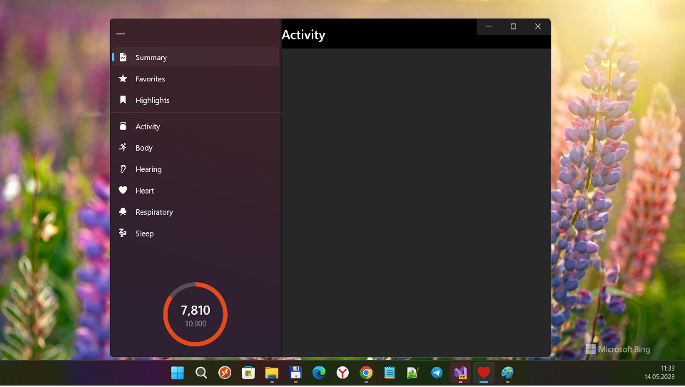

# HealthAppUNO

"Design/Code pattern": Multiplatform Health app Sample in Uno Platform

## Screenshots

## Description
This sample shows a concept of a Health app running on Windows 10, iOS, iPadOS, macOS, Android & WebAssembly using [Uno Platform](https://platform.uno/) (see also on [GitHub](https://github.com/unoplatform/uno/)). 

Inspired by [Jordan Singer](https://twitter.com/jsngr?s=20).

I used [Martin Zikmund 's Uno Health app "design pattern / code template"](https://github.com/MartinZikmund/uno-health-app-concept/) for my RnD.

## Status
- UWP Project Demaged. If I change min. os. build to 16299, all seems to be ok. But for 15063 I catch the strange bug "Memory access violation". :(
- Perhaps, Uno.Core and Uno.UI not liked Microsoft.UI.Xaml.Controls … idk, really!
- I tried to switch from newest VS 2022 Preview to stable 2022. Maybe, it's partially helps me to solve UNO puzzle..

## Contribute
- UNO C# developers, please help me if you can...
- Feel free to open an issue if you want to report a bug, give feedback, or just want to ask a question. PRs are very appreciated.
- I open Issue "Help wanted".

## ..
AS IS. No support. RnD only.

## .
[m][e] 2022